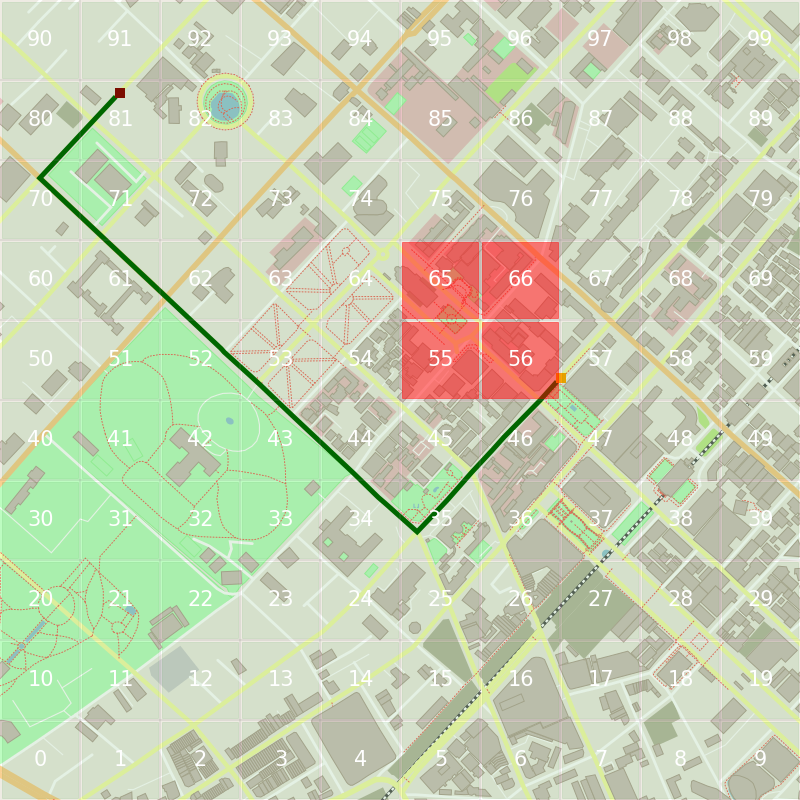

# Routing

## 1. Setup environment
- Install [Visual Studio 2019](https://visualstudio.microsoft.com/downloads/) with C++ Desktop components
- Install [vcpkg - C++ Library Manager](https://github.com/microsoft/vcpkg)
- Install required packages:

```
vcpkg.exe install io2d:x64-windows pugixml:x64-windows
vcpkg.exe install io2d:x86-windows pugixml:x86-windows
```

## 2. Demo

Navigate:
- From **Red Point (16, 92)**: University of Economics Ho Chi Minh City - UEH
- To **Orange Point (67, 53)**: Vincom Dong Khoi

Result without traffic infomation:


Result with traffic infomation (traffic jam in zone 55, 546, 65 and 66):


